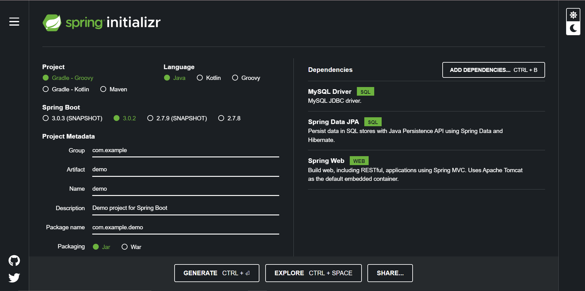
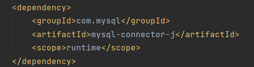
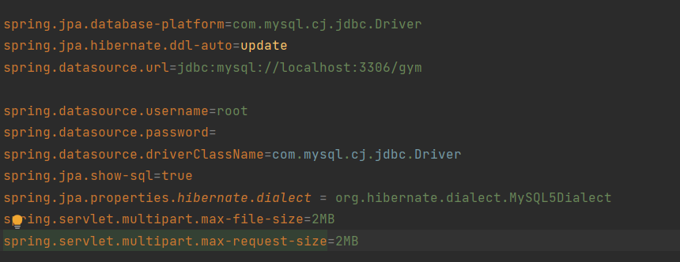
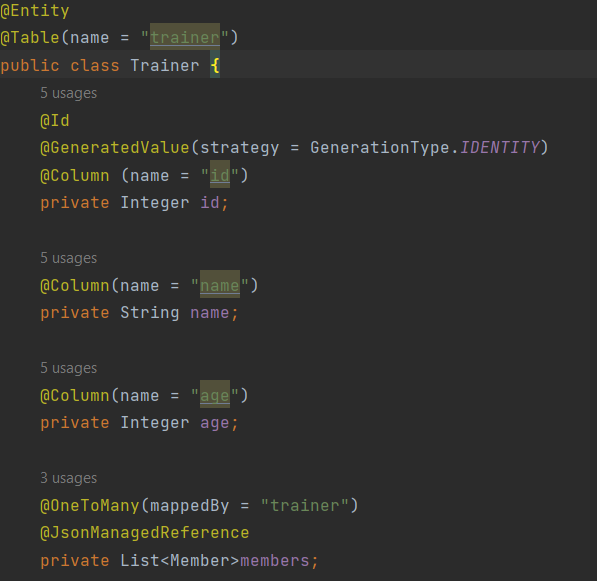

# GymManagmentSystem

This is a Springboot project for Java Progamming language. Gym Managment System project contains 4 package: pojo, service, repository and controller.in pojo we have Trainer class, Member class and Equipments class. At first a trainer is created to database and then when we want to create a member we should create it only by defining the trainer's id, as a @Path Variable. So every member should have a trainer.You can create, edit, delete or show all trainers.

## Requirements
<h3>For building and running the application you will need:</h3>
<ul>
<li><a href="https://www.oracle.com/java/technologies/downloads/#java8">JDK 1.8</a></li>
<li><a href="https://www.jetbrains.com/idea/download/#section=windows">IntelliJ IDEA</a></li>
<li><a href="https://insomnia.rest/download">Insomnia</a></li>
<li><a href="https://www.apachefriends.org/download.html">XAMPP</a></li>
<li><a href="https://www.phpmyadmin.net/downloads/">phpMyAdmin</a></li>

</ul>

## Steps To Run The Project

At first you should download IntelliJ IDEA Ultimate and then from the <a href="https://start.spring.io">spring initializr</a> you choose your project, I have chose the Maven, language: Java, Spring Boot 27.8.

  

### Dependencies:
<ul>
<li>Spring Web</li>
<li>Spring Data Jpa</li>
<li>MySql Driver</li>
<li>Spring Boot Dev Tools</li>
</ul>

## DDL script

To connect the prpject will database, you should do some changes and write things in application.properties and be sure you have dependency: 

 

 
And in application.properties should add:  

 

 
Then you should create the database in phpmyAdmin and write the database name, after all this you can create the @REST operations and from Insomnia you can write and then it creates automatically the tables and insert records. 

## REST

You can build REST services with both XML and JSON. However, we will build with JSON.

### REST and HTTP

REST is built on top of HTTP (Hypertext Transfer Protocol). HTTP is the language of the web. 

HTTP has a few important verbs.

<ul>
<li>POST: Create a new resource</li>
<li>GET: Read an article</li>
<li>PUT: Update an existing resource</li>
<li>DELETE: Delete a resource</li>

## Make Your Very First JPA Entity 

The first step is to create a JPA Entity. First let's create a trainer entity with a primary key id.

 

